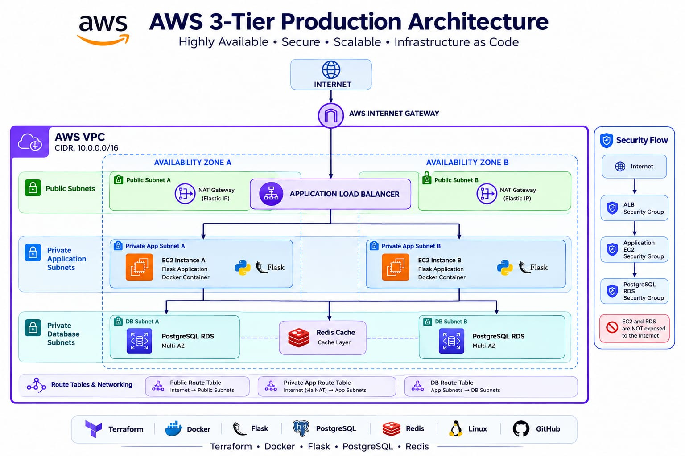

# AWS 3-Tier Production Architecture

A production-style AWS 3-Tier Architecture designed using Terraform and AWS networking best practices.
<p align="center">
  
  
  
  
  
  
  
</p>

<p align="center">
  <b>Production-style AWS 3-Tier Architecture using Terraform, Docker, PostgreSQL, Redis and AWS networking best practices.</b>
</p>

---

## 👨‍💻 Author

**Jaikrish – Junior Cloud Engineer**

Focused on Cloud Computing, AWS, DevOps, Linux, and Networking.

---

## 🏗️ Architecture



The architecture follows a highly available 3-tier design:

- **Presentation Tier** – Application Load Balancer
- **Application Tier** – EC2 instances in private subnets
- **Database Tier** – Amazon RDS in private subnets
- **VPC** – Custom AWS network with public and private subnets
- **Multi-AZ** – Designed for high availability

---
## Project Overview

This project demonstrates the design and implementation of a production-style **AWS 3-Tier Architecture** using Infrastructure as Code and containerization technologies.

The architecture separates the infrastructure into three logical layers:

- Public / Load Balancing Tier
- Private Application Tier
- Private Database Tier

The infrastructure is designed with **Multi-AZ networking, security groups, NAT Gateways, Application Load Balancer, EC2, RDS PostgreSQL and Redis caching**.

The application layer contains a lightweight Flask application packaged as a Docker container.

The infrastructure is defined using Terraform modules to make the architecture reusable, maintainable and scalable.

---


## ☁️ AWS Services

- Amazon VPC
- Application Load Balancer (ALB)
- Amazon EC2
- Amazon RDS
- IAM
- Amazon CloudWatch
- Internet Gateway
- NAT Gateway
- Security Groups

---

## 🛠️ Technologies

- Terraform
- AWS
- Linux
- Git
- GitHub
- Infrastructure as Code (IaC)

--- 


## Project Goal

The primary goal of this project is to demonstrate how a production-style cloud application can be designed using AWS networking and DevOps best practices.
Key objectives:

- Design a secure AWS VPC
- Implement public and private subnet architecture
- Deploy resources across multiple Availability Zones
- Configure an Application Load Balancer
- Deploy application servers in private subnets
- Implement PostgreSQL database infrastructure
- Implement Redis caching
- Use Security Groups for tier-to-tier communication
- Provision infrastructure using Terraform
- Containerize the Flask application using Docker
- Implement application health checks
- Create a monitoring-ready architecture
- Maintain clean Infrastructure as Code practices

---

# Architecture

```text
                              INTERNET
                                  |
                                  v
                         +----------------+
                         | Internet Gateway|
                         +--------+-------+
                                  |
                    +-------------+-------------+
                    |                           |
                    v                           v
             PUBLIC SUBNET AZ-A          PUBLIC SUBNET AZ-B
                    |                           |
                    +-------------+-------------+
                                  |
                                  v
                       +----------------------+
                       | Application Load     |
                       | Balancer (ALB)       |
                       +----------+-----------+
                                  |
                    +-------------+-------------+
                    |                           |
                    v                           v
             PRIVATE APP AZ-A            PRIVATE APP AZ-B
                    |                           |
             +------+-------+             +-----+------+
             | EC2 / Flask |             | EC2 / Flask|
             | Application  |             | Application |
             +------+-------+             +-----+------+
                    |                           |
                    +-------------+-------------+
                                  |
                                  v
                         PRIVATE DB SUBNETS
                                  |
                    +-------------+-------------+
                    |                           |
                    v                           v
              PostgreSQL RDS              Redis Cache
                Multi-AZ                    Layer
                    |
                    v
              Application Data

## 🏗️ Architecture

## 🚀 Deployment

The infrastructure is provisioned using Terraform.


### Format Terraform Files

```bash
terraform fmt -recursive
```

### Review Infrastructure

```bash
terraform plan
```

### Deploy Infrastructure

```bash
terraform apply
```

Type `yes` when Terraform asks for confirmation.

---

## 🐳 Docker Deployment

The Flask application is containerized using Docker.

### Build Docker Image

```bash
docker build -t flask-app .
```

### Run Container

```bash
docker run -d -p 5000:5000 flask-app
```

The application can then be accessed locally using:

```text
http://localhost:5000
```

---

## 🔐 Security

The architecture follows a least-privilege security model.

### Security Group Communication

```text
Internet
    |
    v
Application Load Balancer
    |
    v
EC2 Application Tier
    |
    +------> PostgreSQL RDS
    |
    +------> Redis Cache
```

Security practices implemented:

* ALB handles public traffic
* EC2 instances are deployed in private subnets
* EC2 does not require direct public access
* RDS is isolated inside private subnets
* Database access is restricted using Security Groups
* Application-to-database communication is controlled
* Redis access is restricted to the application tier
* NAT Gateway provides controlled outbound internet access for private resources

---

## 📁 Project Structure

```text
aws-3-tier-production-architecture/
│
├── app/
│   ├── app.py
│   ├── requirements.txt
│   └── Dockerfile
│
├── terraform/
│   ├── main.tf
│   ├── variables.tf
│   ├── outputs.tf
│   ├── provider.tf
│   └── modules/
│
├── architecture.png
├── README.md
└── .gitignore
```

> Update this structure if your actual project folders are different.

---

## 📊 Monitoring

Amazon CloudWatch can be used to monitor the infrastructure and application.

Monitoring areas include:

* EC2 CPU utilization
* Application logs
* ALB metrics
* Target health
* RDS metrics
* Infrastructure health

---

## 🔄 High Availability

The architecture uses multiple Availability Zones to improve availability and fault tolerance.

```text
                    Application Load Balancer
                           /       \
                          /         \
                         v           v
                       AZ-A         AZ-B
                        |             |
                       EC2           EC2
                        \             /
                         \           /
                          v         v
                         RDS Multi-AZ
```

Benefits:

* High availability
* Fault tolerance
* Better reliability
* Application resilience
* Multi-AZ architecture

---

## 🧪 Application Verification

After deployment:

1. Obtain the Application Load Balancer DNS name.
2. Open the ALB DNS name in a browser.
3. Verify that the Flask application loads.
4. Check the Target Group health status.
5. Verify EC2 application logs.
6. Verify database connectivity.
7. Verify Redis connectivity.

Example:

```text
http://<ALB-DNS-NAME>
```

---

## 💡 Key Learnings

This project provided practical experience with:

* AWS VPC architecture
* Public and private subnet design
* Route Tables
* Internet Gateway
* NAT Gateway
* Application Load Balancer
* EC2
* RDS PostgreSQL
* Redis
* Security Groups
* Docker containerization
* Terraform Infrastructure as Code
* Linux administration
* AWS troubleshooting
* High Availability architecture

---

## 📸 Screenshots

### AWS Architecture


### Terraform Deployment

*Add Terraform deployment screenshot here.*

### AWS Resources

*Add AWS Console screenshot here.*

### Application

*Add application screenshot here.*

---

## 🧹 Destroy Infrastructure

To remove the infrastructure created by Terraform:

```bash
terraform destroy
```

> ⚠️ Make sure important resources and data are backed up before destroying infrastructure.

---

## 📌 Project Highlights

| Feature          | Implementation            |
| ---------------- | ------------------------- |
| Cloud Provider   | AWS                       |
| Architecture     | 3-Tier                    |
| Infrastructure   | Terraform                 |
| Load Balancing   | Application Load Balancer |
| Compute          | EC2                       |
| Database         | PostgreSQL RDS            |
| Cache            | Redis                     |
| Containerization | Docker                    |
| Application      | Flask                     |
| Networking       | VPC                       |
| Availability     | Multi-AZ                  |
| Monitoring       | CloudWatch                |
| Operating System | Linux                     |

---

## 🎯 Project Objective

This project was built to demonstrate practical **Cloud Engineering and DevOps skills** by designing a production-style AWS environment using modern infrastructure, networking, security, containerization, and Infrastructure as Code practices.

---

## 📜 License

This project is created for **learning, portfolio, and demonstration purposes**.
